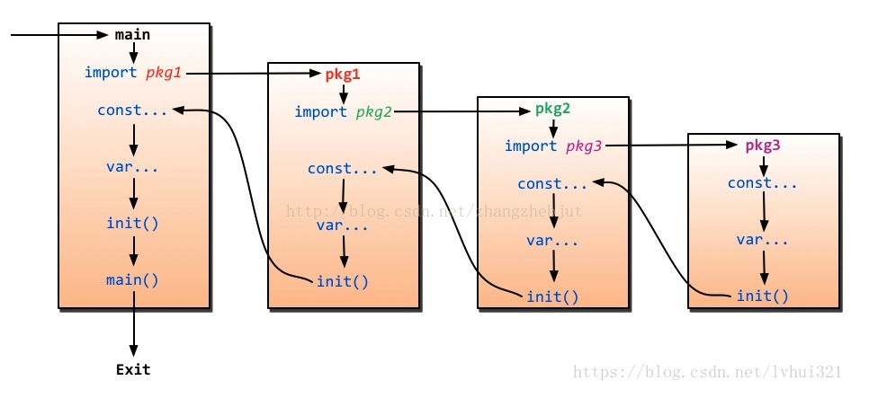

# 1. 工作区和gopath

## 1.1 三个环境变量

* `GOROOT`  gopath可以是一个活着多个目录路径。每个目录都代表着go 的一个工作区，这些工作区可以放置源码文件， 安装后的可执行文件（.a为扩展名的文件）， go 语言生命周期中所有的操作都是围绕着gopath和工作区workspace来进行的。
* `GOPATH`
* `GOBIN`

## 1.2 go 语言源码的组织方式

go源代码是以代码包为基本组织单位的。每个代码包都有导入路径。代码包的导入路径是其他代码使用该包时需要引入的路径

在工作区中，一个代码包实际是从src子目录，到该包的实际存储位置的相对路径。

源码文件安装后产生的归档文件，会被放到pkg子目录中， 如果产生了可执行文件的话， 就会进入该工作区的bin 目录。

### 1.3 归档文件存放具体位置和规则

归档文件的相对目录距离pkg还有一成目录，叫做平台相关目录，平台相关目录是由build 的目标操作系统，下划线， 目标计算机架构代号组成。比如linux_amd64, 如`pkg/linux_amd64/github.com/x x x`

### 1.4 go build的一些选项

* `-x` 这个选项爱你够可以看到go build命令到底执行了哪些操作
* `-n` 之查看具体操作而不真正执行他们

### 1.5 go get的一些选项

* 
* `-u` 下载并安装代码包
* `-d`  只下载，不安装代码包
* `-fix` 在下载代码包后先运行一个用于当前go版本的修正代码工具，然后再安装代码包
* `-t` 同时下载测试所需的代码包
* `-insecure` 允许非安全的网络协议下载和安装代码包，http 就是这样的

### 1.6 go 语言中，查找依赖包的顺序

依赖的解决，如a的a1依赖B 的b 方法，b又依赖a的a2方法，包之间存在循环以来，解决方式是通过第三方变量赋值的方式解决。

需要注意的a .a依赖b.b ， b.b  同时依赖a.a 这种是锁死的搞不了的。这种事逻辑错误了。

在查找依赖包时会先查找最外层的依赖pkg3,  先从GOROOT， 也就是go 的sdk里搜一下，如果没有继续从gopath, gopath 因为可能有多个目录，挨个顺序扫描， 如果还没有就panic 了， 同样go  get的时候也是这个套路，先走上面， 如果没有查找到就从网络上搜索资源。

 

### 1.7 多个工作区中都导入相同的代码包会产生冲突吗

不会，顺序执行的，找到了就跳出了，已最前面工作区的代码包为准。

### 1.8 为什么需要gopath

* 代码集中管理，方便引用
* 从编译器角度来说，我们需要一个固定的路径去搜索依赖，因为如果我们去执行一个go run main.go 的时候，如果其中依赖了三方库，那么我如何去本地读取到它，这里通过一个预定义的魔术常量来获取到它的本地位置，方便加载,这也是为什么好多语言都有一些类似GOPATH, JAVA_HOME 这类的魔术常量了，通过约定的方式，方便获取本地目录位置。

